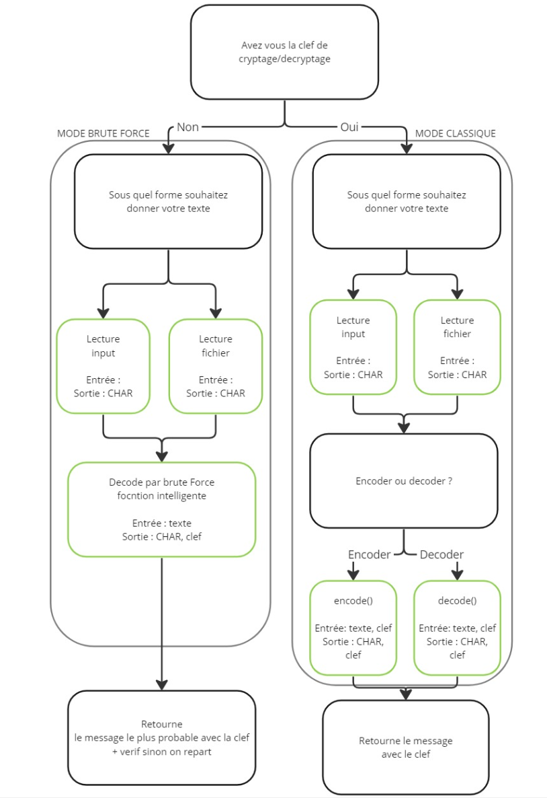

# VeniVidiVici
Algorithme pour encoder/décoder un texte via le chiffrement Cesar
"Veni, vidi, vici" est une phrase latine célèbre attribuée à Jules César, l'un des plus grands généraux et leaders de l'Empire romain. Elle se traduit par "Je suis venu, j'ai vu, j'ai vaincu" et témoigne de la rapidité et de l'efficacité de ses conquêtes militaires, tout comme de notre script.

## Fonctionnement:
L'utilisteur peut cypter ou décrypter:
- un message qu'il écrit directement dans le terminal 
- un fichier texte  
Il lui suffit ensuite de rentrer la clef de cryptage et il obtient le message crypté/décrypté.
Dans le cas où l'utilisateur ne connait pas la clef de cryptage, il est possible de l'estimer par la méthode brute force.

## Composition
Le projet est composé de 4 fichiers:
- main.py : fichier à "run" pour lancer le projet
- Interface.py : programme mettant en place l'interface utilisateur 
- GestionFichier.py : programme gérant l'ouverture, la lecture  et l'écriture de fichier textes
- DecrypterCrypter.py : algorithmes de cryptage et décryptage
- verifications.py : algorithmes de vérification des réponses entrées par l'utilisateur

 
